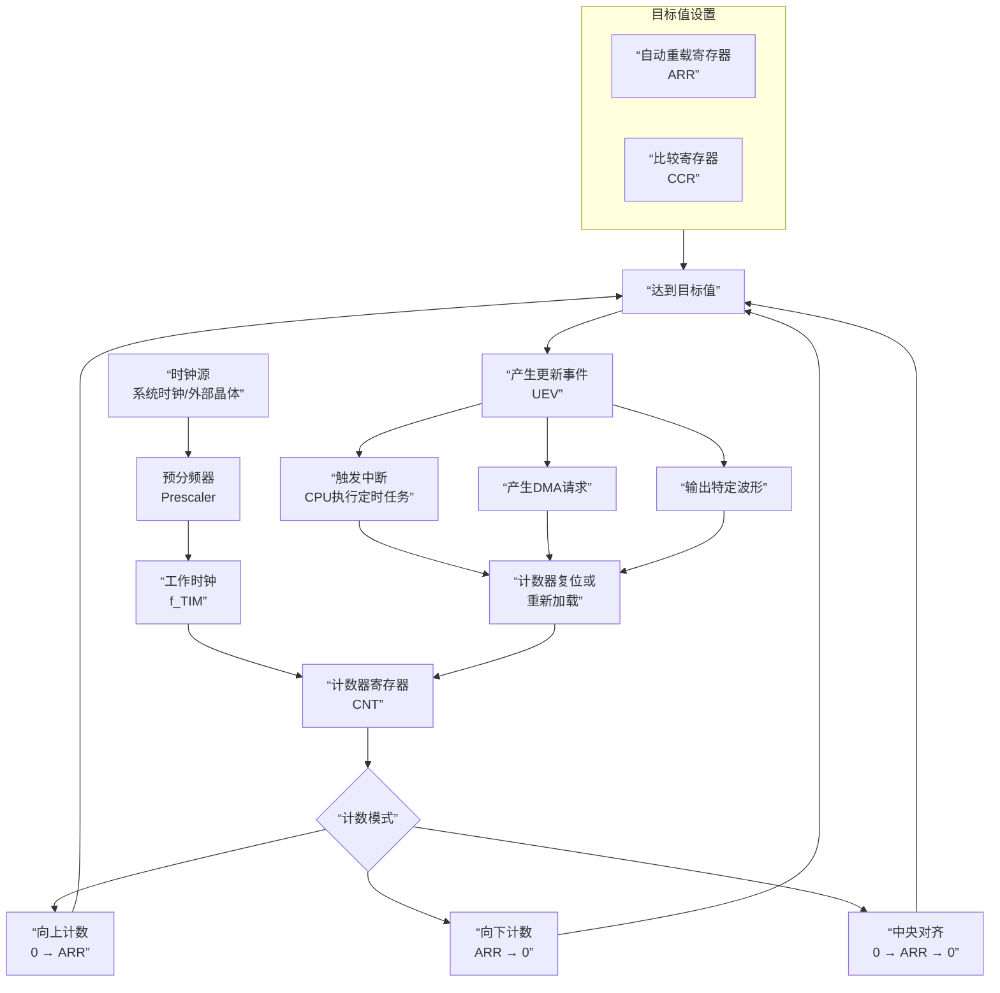

# 概念
## 什么是定时器
**核心概念**：定时器本质上是一个**自主运行的计数器**，它不依赖CPU的干预，能够精确地计量时间间隔。

## 核心工作原理


**关键点说明**：
- **时钟源**：定时器的"心跳"，通常来源于系统时钟或外部晶体振荡器。
- **预分频器**：将时钟源分频，获得更低的计数频率。
  - 例如：系统时钟72MHz，预分频设为71，则定时器时钟 = 72MHz / (71+1) = 1MHz
- **计数器**(CNT )：核心的计数单元，每个时钟周期加1或减1。
- **自动重载寄存器**：定义计数器的上限值，决定定时周期。
- **比较寄存器**（CCR）：用于产生精确的PWM波形或特定时间点的事件。

## 工作模式
- **基本定时器 (TIM6, TIM7)**：只能向上计数，主要用来做时基（比如触发ADC）。
- **通用定时器 (TIM2, TIM3, TIM4, TIM5)**：功能丰富，支持PWM、输入捕获、编码器接口等。
- **高级控制定时器 (TIM1, TIM8)**：在通用定时器基础上，增加了互补输出、死区控制、刹车功能，专门用于电机控制。
通常我们说的“定时器工作模式”，主要包含以下几大类：

---

### 核心时基模式（计数器怎么数）
这是定时器的基础，决定了计数的方向。
1. **向上计数模式 (Upcounting)**：最常用。计数器从0数到自动重装载值（ARR），产生溢出事件，然后回到0重新开始。
2. **向下计数模式 (Downcounting)**：计数器从ARR数到0，产生下溢事件，然后重新从ARR开始。
3. **中央对齐模式 (Center-aligned)**：计数器从0数到ARR-1，产生溢出；然后向下数到1，产生下溢。如此循环。
    - _用途_：常用于电机控制，生成对称的PWM波，谐波更小。

### 输出模式（引脚输出什么信号）
定时器可以通过比较寄存器（CCR）控制引脚输出。
4. **输出比较模式 (Output Compare)**：当计数器CNT的值等于CCR时，引脚电平发生翻转（或置高/置低）。可以用来产生特定频率的方波。
5. **PWM输出模式 (PWM)**：最常用的模式。
    - **PWM模式1**：CNT < CCR时，输出有效电平；CNT >= CCR时，输出无效电平。
    - **PWM模式2**：与模式1相反。
    - _用途_：调节LED亮度（呼吸灯）、控制电机转速、舵机角度。
6. **强制输出模式 (Forced Output)**：无视计数器比较结果，软件直接强制引脚输出高或低电平。用于调试或紧急控制。
7. **单脉冲模式 (One Pulse Mode)**：收到一个触发信号后，输出一个指定长度和延迟的脉冲，然后自动停止。常用于超声波测距的触发信号。

### 输入模式（引脚检测什么信号）
定时器可以“听”外部引脚上的信号。
8. **输入捕获模式 (Input Capture)**：当引脚检测到指定边沿（上升沿/下降沿）时，把当前计数器CNT的值“抓”进CCR寄存器。
    - _用途_：测量脉冲宽度（如超声波回波的高电平时间）、测量频率、计算占空比。
9. **PWM输入模式 (PWM Input)**：输入捕获的特例。使用两个通道（TI1和TI2）同时捕获同一个引脚，一个抓周期，一个抓高电平时间，硬件自动算出频率和占空比。

### 特殊/高级模式
10. **编码器接口模式 (Encoder Interface)**：定时器直接连接正交编码器（A相和B相）。根据两相的跳变顺序，硬件自动向上或向下计数，直接读取旋转位置和方向。_（做旋钮/电机测速神器）_
11. **主从同步模式 (Master/Slave)**：一个定时器（主）可以控制另一个定时器（从）的复位、启动、停止或提供时钟，实现多个定时器级联同步。
12. **霍尔传感器接口 (Hall Sensor)**：高级定时器专用，用于无刷直流电机的换相检测。
13. **刹车与死区插入 (Break & Dead-time)**：高级定时器专用。用于电机H桥驱动，防止上下桥臂同时导通短路（死区），并在发生故障（刹车输入）时立刻强制关闭输出，保护硬件。

# 硬件连接
``` text
GPIOA_Pin_1 ── 限流电阻 R1 ── LED1阳极 ── LED1阴极 ── GND
GPIOA_Pin_2 ── 限流电阻 R2 ── LED2阳极 ── LED2阴极 ── GND
GPIOA_Pin_3 ── 限流电阻 R3 ── LED3阳极 ── LED3阴极 ── GND
VCC ── 按键 ── GPIOA_Pin_4
```

# 本节实现目标
- 用 TIM2 的三个通道输出硬件 PWM
- 控制 PA1 / PA2 / PA3 三个 LED
- 实现 OFF / ON / BLINK / BREATH / FLOW 五种模式
- 呼吸模式三个 LED 差速呼吸
- 按键短按切换模式，长按关闭
## PWM 频率计算
- 系统时钟：72MHz
- 预分频 PSC = 71 → 定时器时钟 = 72MHz / (71+1) = 1MHz
- 自动重装载 ARR = 1000 - 1 = 999
- PWM 频率 = 1MHz / (999+1) = 1kHz
==1kHz 对 LED 足够，人眼看不到闪烁。

# 代码
``` c
// main.c
#include "stm32f10x.h"
#include "misc.h"
#include "LED.h"
#include "KEY.h"
#include "Systick.h"
#include "OLED.h"

int main(void)
{
    LED_Init();
    KEY_Init();
    SysTick_Init();
    OLED_Init();

    LED_SetMode(LED_MODE_OFF);
    LedMode_t last_mode = LED_MODE_OFF;
    uint32_t last_oled_tick = 0;

    OLED_ShowString(1, 1, "LED_MODE:");

    while (1)
    {
        KeyEvent_t event = KEY_StateMachine();

        if (event == KEY_EVENT_SHORT_PRESS)
        {
            LedMode_t m = LED_GetMode();
            if (last_mode != LED_MODE_OFF)
            {
                m = last_mode;
                last_mode = LED_MODE_OFF;
            }
            else
            {
                m = (LedMode_t)((m + 1) % 5);
                if (m == LED_MODE_OFF)
                {
                    m = (LedMode_t)(m + 1);
                }
            }
            LED_SetMode(m);
        }
        else if (event == KEY_EVENT_LONG_PRESS)
        {
            if (last_mode == LED_MODE_OFF && LED_GetMode() != LED_MODE_OFF) {
                last_mode = LED_GetMode();
                LED_SetMode(LED_MODE_OFF);
            }
        }

        LED_Update();

        // 每 100ms 刷新一次 OLED，避免拖慢软件 PWM
        if (IsTimeout(last_oled_tick, 100))
        {
            last_oled_tick = GetTick();

            switch (LED_GetMode())
            {
                case LED_MODE_OFF:
                    OLED_ShowString(2, 1, "Led_Off   ");
                    break;
                case LED_MODE_ON:
                    OLED_ShowString(2, 1, "Led_On    ");
                    break;
                case LED_MODE_BLINK:
                    OLED_ShowString(2, 1, "Led_Blink ");
                    break;
                case LED_MODE_BREATH:
                    OLED_ShowString(2, 1, "Led_Breath");
                    break;
                case LED_MODE_FLOW:
                    OLED_ShowString(2, 1, "Led_Flow  ");
                    break;
                default:
                    OLED_ShowString(2, 1, "Led_Off   ");
                    break;
            }
        }
    }
}

```

``` c
// LED.c
#include "stm32f10x.h"                  // Device header
#include "LED.h"

// ---------- 内部状态变量 ---------- 
static LedMode_t led_mode           = LED_MODE_OFF;   // 当前模式
static uint32_t  led_tick           = 0;              // 通用时间戳
static uint8_t   blink_state        = 0;              // 闪烁状态
static uint8_t   led1_breath_dir    = 0;              // 呼吸方向：0=变亮，1=变暗
static uint16_t  led1_breath_val    = 0;              // 呼吸灯当前亮度
static uint8_t   led2_breath_dir    = 0;              // 呼吸方向：0=变亮，1=变暗
static uint16_t  led2_breath_val    = 500;            // 呼吸灯当前亮度
static uint8_t   led3_breath_dir    = 1;              // 呼吸方向：0=变亮，1=变暗
static uint16_t  led3_breath_val    = 1000;            // 呼吸灯当前亮度
static uint8_t   flow_index         = 0;              // 顺序点亮的当前位置
static uint8_t   mode_changed       = 0;

static void LED_Off(void);
static void LED_On(void);
void LED_Init(void)
{
    // 使能GPIOA时钟
    RCC_APB2PeriphClockCmd(RCC_APB2Periph_GPIOA, ENABLE);
    RCC_APB1PeriphClockCmd(RCC_APB1Periph_TIM2, ENABLE);

    // 创建结构体
    GPIO_InitTypeDef LED_GPIO_Init;
    LED_GPIO_Init.GPIO_Pin = GPIO_Pin_1 | GPIO_Pin_2 | GPIO_Pin_3;
    LED_GPIO_Init.GPIO_Mode = GPIO_Mode_AF_PP;
    LED_GPIO_Init.GPIO_Speed = GPIO_Speed_50MHz;
    
    GPIO_Init(GPIOA, &LED_GPIO_Init);
    
    // TIM2 基础配置
    TIM_TimeBaseInitTypeDef TIM_TimeBaseStruct;
    // 自动重装载值：0x0000 - 0xFFFF (16位定时器)
    TIM_TimeBaseStruct.TIM_Period        = 1000 - 1;
    // 预分频器：0x0000 - 0xFFFF
    TIM_TimeBaseStruct.TIM_Prescaler     = 72 - 1;
    // 计数模式
    TIM_TimeBaseStruct.TIM_CounterMode   = TIM_CounterMode_Up;
    // 时钟分频，用于配置数字滤波器的采样时钟
    TIM_TimeBaseStruct.TIM_ClockDivision = TIM_CKD_DIV1;
    TIM_TimeBaseInit(TIM2, &TIM_TimeBaseStruct);
    
    // PWM配置
    TIM_OCInitTypeDef TIM_OCInitStruct;
    // 占空比
    TIM_OCInitStruct.TIM_Pulse       = 0;
    TIM_OCInitStruct.TIM_OCMode      = TIM_OCMode_PWM1;
    TIM_OCInitStruct.TIM_OCPolarity  = TIM_OCPolarity_High;
    TIM_OCInitStruct.TIM_OutputState = TIM_OutputState_Enable;
    
    TIM_OC2Init(TIM2, &TIM_OCInitStruct);    // PA1 -> TIM2_CH2
    TIM_OC3Init(TIM2, &TIM_OCInitStruct);    // PA2 -> TIM2_CH3
    TIM_OC4Init(TIM2, &TIM_OCInitStruct);    // PA3 -> TIM2_CH4
    
    // 使能预装载
    TIM_OC2PreloadConfig(TIM2, TIM_OCPreload_Enable);
    TIM_OC3PreloadConfig(TIM2, TIM_OCPreload_Enable);
    TIM_OC4PreloadConfig(TIM2, TIM_OCPreload_Enable);
    
    TIM_Cmd(TIM2, ENABLE);
    
}

static void LED_Off(void)
{
    LED_SetBrightness(LED1, 0);
    LED_SetBrightness(LED2, 0);
    LED_SetBrightness(LED3, 0);
}

static void LED_On(void)
{
    LED_SetBrightness(LED1, PWM_PERIOD);
    LED_SetBrightness(LED2, PWM_PERIOD);
    LED_SetBrightness(LED3, PWM_PERIOD);
}

void LED_SetBrightness(uint8_t led, uint16_t brightness)
{
    switch (led)
    {
        case LED1:
            TIM_SetCompare2(TIM2, brightness);
            break;
        case LED2:
            TIM_SetCompare3(TIM2, brightness);
            break;
        case LED3:
            TIM_SetCompare4(TIM2, brightness);
            break;
        default:
            break;
    }
}

static void LED_SetBreath(uint8_t *breath_dir, uint16_t *breath_val, uint8_t speed)
{
    if (*breath_dir == 0)
    {
        *breath_val += speed;
        if (*breath_val >= PWM_PERIOD)
        {
            *breath_val = PWM_PERIOD;
            *breath_dir = 1;
        }
    }
    else
    {
        if (*breath_val >= speed)
        {
            *breath_val -= speed;
        }
        else
        {
            *breath_val = 0;
        }
        if (*breath_val == 0)
        {
            *breath_dir = 0;
        }
    }
}

// 切换模式
void LED_SetMode(LedMode_t mode)
{
    led_mode = mode;
    mode_changed = 1;
    
    led_tick = GetTick();
    blink_state   = 0;
    led1_breath_dir    = 0;
    led1_breath_val    = 0;
    led2_breath_dir    = 0;
    led2_breath_val    = 500;
    led3_breath_dir    = 1;
    led3_breath_val    = 1000;
    flow_index    = 0;
    
    LED_Off();    
}

LedMode_t LED_GetMode(void)
{
    return led_mode;
}

void LED_Update(void)
{
    switch (led_mode)
    {
        case LED_MODE_OFF:
            if (mode_changed)
            {
                LED_Off();
                mode_changed = 0;
            }
            break;

        case LED_MODE_ON:
            if (mode_changed)
            {
                LED_On();
                mode_changed = 0;
            }
            break;

        case LED_MODE_BLINK:
            if (IsTimeout(led_tick, 1000))
            {
                led_tick = GetTick();
                blink_state = !blink_state;
                uint16_t v = blink_state ? 1000 : 0;
                LED_SetBrightness(LED1, v);
                LED_SetBrightness(LED2, v);
                LED_SetBrightness(LED3, v);
            }
            break;

        case LED_MODE_BREATH:
            if (IsTimeout(led_tick, 10))
            {
                led_tick = GetTick();
                LED_SetBreath(&led1_breath_dir, &led1_breath_val, 3);
                LED_SetBreath(&led2_breath_dir, &led2_breath_val, 7);
                LED_SetBreath(&led3_breath_dir, &led3_breath_val, 11);
                LED_SetBrightness(LED1, led1_breath_val);
                LED_SetBrightness(LED2, led2_breath_val);
                LED_SetBrightness(LED3, led3_breath_val);
            }
            break;

        case LED_MODE_FLOW:
            if (IsTimeout(led_tick, 300))
            {
                led_tick = GetTick();
                flow_index = (flow_index + 1) % 3;
                LED_SetBrightness(LED1, (flow_index == 0) ? PWM_PERIOD : 0);
                LED_SetBrightness(LED2, (flow_index == 1) ? PWM_PERIOD : 0);
                LED_SetBrightness(LED3, (flow_index == 2) ? PWM_PERIOD : 0);
            }
            break;

        default:
            led_mode = LED_MODE_OFF;
            break;
    }
}

```

``` c
// LED.h
#ifndef __LED_H
#define __LED_H

#include "Systick.h"

#define LED1 1
#define LED2 2
#define LED3 3
#define PWM_PERIOD   1000

typedef enum {
    LED_MODE_OFF = 0, // 熄灭
    LED_MODE_ON,      // 点亮
    LED_MODE_BLINK,   // 闪烁
    LED_MODE_BREATH,  // 呼吸
    LED_MODE_FLOW     // 流动
} LedMode_t;

void LED_Init(void);
void LED_SetMode(LedMode_t mode);
void LED_SetBrightness(uint8_t led, uint16_t brightness);
LedMode_t LED_GetMode(void);
void LED_Update(void);

#endif

```

``` c
// KEY.c
#include "KEY.h"

#define KEY_PORT        GPIOA
#define KEY_PIN         GPIO_Pin_4

typedef enum {
    STATE_IDLE = 0,
    STATE_DEBOUNCE,
    STATE_PRESSED,
    STATE_RELEASE
} KeyState_t;

static KeyState_t key_state = STATE_IDLE;
static uint32_t key_press_tick = 0;

void KEY_Init(void)
{
    GPIO_InitTypeDef GPIO_InitStructure;

    RCC_APB2PeriphClockCmd(RCC_APB2Periph_GPIOA, ENABLE);

    GPIO_InitStructure.GPIO_Pin   = KEY_PIN;
    GPIO_InitStructure.GPIO_Mode  = GPIO_Mode_IPD;   // 下拉输入，按下为高
    GPIO_InitStructure.GPIO_Speed = GPIO_Speed_2MHz;
    GPIO_Init(KEY_PORT, &GPIO_InitStructure);
}

KeyEvent_t KEY_StateMachine(void)
{
    KeyEvent_t event = KEY_EVENT_NONE;
    uint8_t pin = GPIO_ReadInputDataBit(KEY_PORT, KEY_PIN);

    switch (key_state)
    {
        case STATE_IDLE:
            if (pin)
            {
                key_state = STATE_DEBOUNCE;
                key_press_tick = GetTick();      // 记录进入消抖的时间
            }
            break;

        case STATE_DEBOUNCE:
            if (IsTimeout(key_press_tick, 20))   // 消抖 20ms
            {
                if (pin)
                {
                    key_state = STATE_PRESSED;
                    key_press_tick = GetTick();  // 记录按下时刻，用于长按判断
                }
                else
                {
                    key_state = STATE_IDLE;      // 20ms 后已松开，视为抖动
                }
            }
            break;

        case STATE_PRESSED:
            if (pin == 0)                        // 松开，短按
            {
                key_state = STATE_IDLE;
                event = KEY_EVENT_SHORT_PRESS;
            }
            else if (IsTimeout(key_press_tick, 1000)) // 长按 1s
            {
                event = KEY_EVENT_LONG_PRESS;
                key_state = STATE_RELEASE;
            }
            break;

        case STATE_RELEASE:
            if (pin == 0)
            {
                key_state = STATE_IDLE;
            }
            break;

        default:
            key_state = STATE_IDLE;
            break;
    }

    return event;
}

```

``` c
// KEY.h
#ifndef KEY_H
#define KEY_H

#include "stm32f10x.h"
#include "Systick.h"

typedef enum {
    KEY_EVENT_NONE = 0,
    KEY_EVENT_SHORT_PRESS,
    KEY_EVENT_LONG_PRESS
} KeyEvent_t;

void KEY_Init(void);
KeyEvent_t KEY_StateMachine(void);

#endif

```

``` c
// Systick.c
#include "Systick.h"

static volatile uint32_t g_tick = 0;

/**
 * @brief  初始化 SysTick，每 1ms 中断一次
 */
void SysTick_Init(void)
{
    // SystemCoreClock 默认 72MHz，除以 1000 得到 1ms 的计数值
    if (SysTick_Config(SystemCoreClock / 1000))
    {
        while (1);   // 配置失败，死循环（一般不会发生）
    }
}

/**
 * @brief  获取系统运行时间（毫秒）
 */
uint32_t GetTick(void)
{
    return g_tick;
}

/**
 * @brief  非阻塞判断：从 start_tick 开始，是否已经过了 ms 毫秒
 * @return 1 = 已超时；0 = 还没到
 */
uint8_t IsTimeout(uint32_t start_tick, uint32_t ms)
{
    // 无符号减法天然处理溢出，49.7 天回绕也不会出错
    return ((GetTick() - start_tick) >= ms) ? 1 : 0;
}

/**
 * @brief  阻塞延时（谨慎使用）
 */
void Systick_Delay_ms(uint32_t ms)
{
    uint32_t start = GetTick();
    while (!IsTimeout(start, ms));
}

/**
 * @brief  SysTick 中断服务函数，每 1ms 触发一次
 */
void SysTick_Handler(void)
{
    g_tick++;
}

```

``` c
// Systick.h
#ifndef __SYSTICK_H
#define __SYSTICK_H

#include "stm32f10x.h"

void     SysTick_Init(void);
uint32_t GetTick(void);
uint8_t  IsTimeout(uint32_t start_tick, uint32_t ms);
void     Systick_Delay_ms(uint32_t ms);   // 阻塞延时，偶尔用可以，但主循环里别用

#endif

```

``` c
// OLED.c
#include "stm32f10x.h"
#include "OLED_Font.h"

/*引脚配置*/
#define OLED_W_SCL(x)		GPIO_WriteBit(GPIOB, GPIO_Pin_8, (BitAction)(x))
#define OLED_W_SDA(x)		GPIO_WriteBit(GPIOB, GPIO_Pin_9, (BitAction)(x))

/*引脚初始化*/
void OLED_I2C_Init(void)
{
    RCC_APB2PeriphClockCmd(RCC_APB2Periph_GPIOB, ENABLE);
	
	GPIO_InitTypeDef GPIO_InitStructure;
 	GPIO_InitStructure.GPIO_Mode = GPIO_Mode_Out_OD;
	GPIO_InitStructure.GPIO_Speed = GPIO_Speed_50MHz;
	GPIO_InitStructure.GPIO_Pin = GPIO_Pin_8;
 	GPIO_Init(GPIOB, &GPIO_InitStructure);
	GPIO_InitStructure.GPIO_Pin = GPIO_Pin_9;
 	GPIO_Init(GPIOB, &GPIO_InitStructure);
	
	OLED_W_SCL(1);
	OLED_W_SDA(1);
}

/**
  * @brief  I2C开始
  * @param  无
  * @retval 无
  */
void OLED_I2C_Start(void)
{
	OLED_W_SDA(1);
	OLED_W_SCL(1);
	OLED_W_SDA(0);
	OLED_W_SCL(0);
}

/**
  * @brief  I2C停止
  * @param  无
  * @retval 无
  */
void OLED_I2C_Stop(void)
{
	OLED_W_SDA(0);
	OLED_W_SCL(1);
	OLED_W_SDA(1);
}

/**
  * @brief  I2C发送一个字节
  * @param  Byte 要发送的一个字节
  * @retval 无
  */
void OLED_I2C_SendByte(uint8_t Byte)
{
	uint8_t i;
	for (i = 0; i < 8; i++)
	{
		OLED_W_SDA(!!(Byte & (0x80 >> i)));
		OLED_W_SCL(1);
		OLED_W_SCL(0);
	}
	OLED_W_SCL(1);	//额外的一个时钟，不处理应答信号
	OLED_W_SCL(0);
}

/**
  * @brief  OLED写命令
  * @param  Command 要写入的命令
  * @retval 无
  */
void OLED_WriteCommand(uint8_t Command)
{
	OLED_I2C_Start();
	OLED_I2C_SendByte(0x78);		//从机地址
	OLED_I2C_SendByte(0x00);		//写命令
	OLED_I2C_SendByte(Command); 
	OLED_I2C_Stop();
}

/**
  * @brief  OLED写数据
  * @param  Data 要写入的数据
  * @retval 无
  */
void OLED_WriteData(uint8_t Data)
{
	OLED_I2C_Start();
	OLED_I2C_SendByte(0x78);		//从机地址
	OLED_I2C_SendByte(0x40);		//写数据
	OLED_I2C_SendByte(Data);
	OLED_I2C_Stop();
}

/**
  * @brief  OLED设置光标位置
  * @param  Y 以左上角为原点，向下方向的坐标，范围：0~7
  * @param  X 以左上角为原点，向右方向的坐标，范围：0~127
  * @retval 无
  */
void OLED_SetCursor(uint8_t Y, uint8_t X)
{
	OLED_WriteCommand(0xB0 | Y);					//设置Y位置
	OLED_WriteCommand(0x10 | ((X & 0xF0) >> 4));	//设置X位置高4位
	OLED_WriteCommand(0x00 | (X & 0x0F));			//设置X位置低4位
}

/**
  * @brief  OLED清屏
  * @param  无
  * @retval 无
  */
void OLED_Clear(void)
{  
	uint8_t i, j;
	for (j = 0; j < 8; j++)
	{
		OLED_SetCursor(j, 0);
		for(i = 0; i < 128; i++)
		{
			OLED_WriteData(0x00);
		}
	}
}

/**
  * @brief  OLED显示一个字符
  * @param  Line 行位置，范围：1~4
  * @param  Column 列位置，范围：1~16
  * @param  Char 要显示的一个字符，范围：ASCII可见字符
  * @retval 无
  */
void OLED_ShowChar(uint8_t Line, uint8_t Column, char Char)
{      	
	uint8_t i;
	OLED_SetCursor((Line - 1) * 2, (Column - 1) * 8);		//设置光标位置在上半部分
	for (i = 0; i < 8; i++)
	{
		OLED_WriteData(OLED_F8x16[Char - ' '][i]);			//显示上半部分内容
	}
	OLED_SetCursor((Line - 1) * 2 + 1, (Column - 1) * 8);	//设置光标位置在下半部分
	for (i = 0; i < 8; i++)
	{
		OLED_WriteData(OLED_F8x16[Char - ' '][i + 8]);		//显示下半部分内容
	}
}

/**
  * @brief  OLED显示字符串
  * @param  Line 起始行位置，范围：1~4
  * @param  Column 起始列位置，范围：1~16
  * @param  String 要显示的字符串，范围：ASCII可见字符
  * @retval 无
  */
void OLED_ShowString(uint8_t Line, uint8_t Column, char *String)
{
	uint8_t i;
	for (i = 0; String[i] != '\0'; i++)
	{
		OLED_ShowChar(Line, Column + i, String[i]);
	}
}

/**
  * @brief  OLED次方函数
  * @retval 返回值等于X的Y次方
  */
uint32_t OLED_Pow(uint32_t X, uint32_t Y)
{
	uint32_t Result = 1;
	while (Y--)
	{
		Result *= X;
	}
	return Result;
}

/**
  * @brief  OLED显示数字（十进制，正数）
  * @param  Line 起始行位置，范围：1~4
  * @param  Column 起始列位置，范围：1~16
  * @param  Number 要显示的数字，范围：0~4294967295
  * @param  Length 要显示数字的长度，范围：1~10
  * @retval 无
  */
void OLED_ShowNum(uint8_t Line, uint8_t Column, uint32_t Number, uint8_t Length)
{
	uint8_t i;
	for (i = 0; i < Length; i++)							
	{
		OLED_ShowChar(Line, Column + i, Number / OLED_Pow(10, Length - i - 1) % 10 + '0');
	}
}

/**
  * @brief  OLED显示数字（十进制，带符号数）
  * @param  Line 起始行位置，范围：1~4
  * @param  Column 起始列位置，范围：1~16
  * @param  Number 要显示的数字，范围：-2147483648~2147483647
  * @param  Length 要显示数字的长度，范围：1~10
  * @retval 无
  */
void OLED_ShowSignedNum(uint8_t Line, uint8_t Column, int32_t Number, uint8_t Length)
{
	uint8_t i;
	uint32_t Number1;
	if (Number >= 0)
	{
		OLED_ShowChar(Line, Column, '+');
		Number1 = Number;
	}
	else
	{
		OLED_ShowChar(Line, Column, '-');
		Number1 = -Number;
	}
	for (i = 0; i < Length; i++)							
	{
		OLED_ShowChar(Line, Column + i + 1, Number1 / OLED_Pow(10, Length - i - 1) % 10 + '0');
	}
}

/**
  * @brief  OLED显示数字（十六进制，正数）
  * @param  Line 起始行位置，范围：1~4
  * @param  Column 起始列位置，范围：1~16
  * @param  Number 要显示的数字，范围：0~0xFFFFFFFF
  * @param  Length 要显示数字的长度，范围：1~8
  * @retval 无
  */
void OLED_ShowHexNum(uint8_t Line, uint8_t Column, uint32_t Number, uint8_t Length)
{
	uint8_t i, SingleNumber;
	for (i = 0; i < Length; i++)							
	{
		SingleNumber = Number / OLED_Pow(16, Length - i - 1) % 16;
		if (SingleNumber < 10)
		{
			OLED_ShowChar(Line, Column + i, SingleNumber + '0');
		}
		else
		{
			OLED_ShowChar(Line, Column + i, SingleNumber - 10 + 'A');
		}
	}
}

/**
  * @brief  OLED显示数字（二进制，正数）
  * @param  Line 起始行位置，范围：1~4
  * @param  Column 起始列位置，范围：1~16
  * @param  Number 要显示的数字，范围：0~1111 1111 1111 1111
  * @param  Length 要显示数字的长度，范围：1~16
  * @retval 无
  */
void OLED_ShowBinNum(uint8_t Line, uint8_t Column, uint32_t Number, uint8_t Length)
{
	uint8_t i;
	for (i = 0; i < Length; i++)							
	{
		OLED_ShowChar(Line, Column + i, Number / OLED_Pow(2, Length - i - 1) % 2 + '0');
	}
}

/**
  * @brief  OLED初始化
  * @param  无
  * @retval 无
  */
void OLED_Init(void)
{
	uint32_t i, j;
	
	for (i = 0; i < 1000; i++)			//上电延时
	{
		for (j = 0; j < 1000; j++);
	}
	
	OLED_I2C_Init();			//端口初始化
	
	OLED_WriteCommand(0xAE);	//关闭显示
	
	OLED_WriteCommand(0xD5);	//设置显示时钟分频比/振荡器频率
	OLED_WriteCommand(0x80);
	
	OLED_WriteCommand(0xA8);	//设置多路复用率
	OLED_WriteCommand(0x3F);
	
	OLED_WriteCommand(0xD3);	//设置显示偏移
	OLED_WriteCommand(0x00);
	
	OLED_WriteCommand(0x40);	//设置显示开始行
	
	OLED_WriteCommand(0xA1);	//设置左右方向，0xA1正常 0xA0左右反置
	
	OLED_WriteCommand(0xC8);	//设置上下方向，0xC8正常 0xC0上下反置

	OLED_WriteCommand(0xDA);	//设置COM引脚硬件配置
	OLED_WriteCommand(0x12);
	
	OLED_WriteCommand(0x81);	//设置对比度控制
	OLED_WriteCommand(0xCF);

	OLED_WriteCommand(0xD9);	//设置预充电周期
	OLED_WriteCommand(0xF1);

	OLED_WriteCommand(0xDB);	//设置VCOMH取消选择级别
	OLED_WriteCommand(0x30);

	OLED_WriteCommand(0xA4);	//设置整个显示打开/关闭

	OLED_WriteCommand(0xA6);	//设置正常/倒转显示

	OLED_WriteCommand(0x8D);	//设置充电泵
	OLED_WriteCommand(0x14);

	OLED_WriteCommand(0xAF);	//开启显示
		
	OLED_Clear();				//OLED清屏
}

```

``` c
// OLED.h
#ifndef __OLED_H
#define __OLED_H

void OLED_Init(void);
void OLED_Clear(void);
void OLED_ShowChar(uint8_t Line, uint8_t Column, char Char);
void OLED_ShowString(uint8_t Line, uint8_t Column, char *String);
void OLED_ShowNum(uint8_t Line, uint8_t Column, uint32_t Number, uint8_t Length);
void OLED_ShowSignedNum(uint8_t Line, uint8_t Column, int32_t Number, uint8_t Length);
void OLED_ShowHexNum(uint8_t Line, uint8_t Column, uint32_t Number, uint8_t Length);
void OLED_ShowBinNum(uint8_t Line, uint8_t Column, uint32_t Number, uint8_t Length);

#endif

```

``` c
// OLED_Font.h
#ifndef __OLED_FONT_H
#define __OLED_FONT_H

/*OLED字模库，宽8像素，高16像素*/
const uint8_t OLED_F8x16[][16]=
{
	0x00,0x00,0x00,0x00,0x00,0x00,0x00,0x00,
	0x00,0x00,0x00,0x00,0x00,0x00,0x00,0x00,//  0
	
	0x00,0x00,0x00,0xF8,0x00,0x00,0x00,0x00,
	0x00,0x00,0x00,0x33,0x30,0x00,0x00,0x00,//! 1
	
	0x00,0x10,0x0C,0x06,0x10,0x0C,0x06,0x00,
	0x00,0x00,0x00,0x00,0x00,0x00,0x00,0x00,//" 2
	
	0x40,0xC0,0x78,0x40,0xC0,0x78,0x40,0x00,
	0x04,0x3F,0x04,0x04,0x3F,0x04,0x04,0x00,//# 3
	
	0x00,0x70,0x88,0xFC,0x08,0x30,0x00,0x00,
	0x00,0x18,0x20,0xFF,0x21,0x1E,0x00,0x00,//$ 4
	
	0xF0,0x08,0xF0,0x00,0xE0,0x18,0x00,0x00,
	0x00,0x21,0x1C,0x03,0x1E,0x21,0x1E,0x00,//% 5
	
	0x00,0xF0,0x08,0x88,0x70,0x00,0x00,0x00,
	0x1E,0x21,0x23,0x24,0x19,0x27,0x21,0x10,//& 6
	
	0x10,0x16,0x0E,0x00,0x00,0x00,0x00,0x00,
	0x00,0x00,0x00,0x00,0x00,0x00,0x00,0x00,//' 7
	
	0x00,0x00,0x00,0xE0,0x18,0x04,0x02,0x00,
	0x00,0x00,0x00,0x07,0x18,0x20,0x40,0x00,//( 8
	
	0x00,0x02,0x04,0x18,0xE0,0x00,0x00,0x00,
	0x00,0x40,0x20,0x18,0x07,0x00,0x00,0x00,//) 9
	
	0x40,0x40,0x80,0xF0,0x80,0x40,0x40,0x00,
	0x02,0x02,0x01,0x0F,0x01,0x02,0x02,0x00,//* 10
	
	0x00,0x00,0x00,0xF0,0x00,0x00,0x00,0x00,
	0x01,0x01,0x01,0x1F,0x01,0x01,0x01,0x00,//+ 11
	
	0x00,0x00,0x00,0x00,0x00,0x00,0x00,0x00,
	0x80,0xB0,0x70,0x00,0x00,0x00,0x00,0x00,//, 12
	
	0x00,0x00,0x00,0x00,0x00,0x00,0x00,0x00,
	0x00,0x01,0x01,0x01,0x01,0x01,0x01,0x01,//- 13
	
	0x00,0x00,0x00,0x00,0x00,0x00,0x00,0x00,
	0x00,0x30,0x30,0x00,0x00,0x00,0x00,0x00,//. 14
	
	0x00,0x00,0x00,0x00,0x80,0x60,0x18,0x04,
	0x00,0x60,0x18,0x06,0x01,0x00,0x00,0x00,/// 15
	
	0x00,0xE0,0x10,0x08,0x08,0x10,0xE0,0x00,
	0x00,0x0F,0x10,0x20,0x20,0x10,0x0F,0x00,//0 16
	
	0x00,0x10,0x10,0xF8,0x00,0x00,0x00,0x00,
	0x00,0x20,0x20,0x3F,0x20,0x20,0x00,0x00,//1 17
	
	0x00,0x70,0x08,0x08,0x08,0x88,0x70,0x00,
	0x00,0x30,0x28,0x24,0x22,0x21,0x30,0x00,//2 18
	
	0x00,0x30,0x08,0x88,0x88,0x48,0x30,0x00,
	0x00,0x18,0x20,0x20,0x20,0x11,0x0E,0x00,//3 19
	
	0x00,0x00,0xC0,0x20,0x10,0xF8,0x00,0x00,
	0x00,0x07,0x04,0x24,0x24,0x3F,0x24,0x00,//4 20
	
	0x00,0xF8,0x08,0x88,0x88,0x08,0x08,0x00,
	0x00,0x19,0x21,0x20,0x20,0x11,0x0E,0x00,//5 21
	
	0x00,0xE0,0x10,0x88,0x88,0x18,0x00,0x00,
	0x00,0x0F,0x11,0x20,0x20,0x11,0x0E,0x00,//6 22
	
	0x00,0x38,0x08,0x08,0xC8,0x38,0x08,0x00,
	0x00,0x00,0x00,0x3F,0x00,0x00,0x00,0x00,//7 23
	
	0x00,0x70,0x88,0x08,0x08,0x88,0x70,0x00,
	0x00,0x1C,0x22,0x21,0x21,0x22,0x1C,0x00,//8 24
	
	0x00,0xE0,0x10,0x08,0x08,0x10,0xE0,0x00,
	0x00,0x00,0x31,0x22,0x22,0x11,0x0F,0x00,//9 25
	
	0x00,0x00,0x00,0xC0,0xC0,0x00,0x00,0x00,
	0x00,0x00,0x00,0x30,0x30,0x00,0x00,0x00,//: 26
	
	0x00,0x00,0x00,0x80,0x00,0x00,0x00,0x00,
	0x00,0x00,0x80,0x60,0x00,0x00,0x00,0x00,//; 27
	
	0x00,0x00,0x80,0x40,0x20,0x10,0x08,0x00,
	0x00,0x01,0x02,0x04,0x08,0x10,0x20,0x00,//< 28
	
	0x40,0x40,0x40,0x40,0x40,0x40,0x40,0x00,
	0x04,0x04,0x04,0x04,0x04,0x04,0x04,0x00,//= 29
	
	0x00,0x08,0x10,0x20,0x40,0x80,0x00,0x00,
	0x00,0x20,0x10,0x08,0x04,0x02,0x01,0x00,//> 30
	
	0x00,0x70,0x48,0x08,0x08,0x08,0xF0,0x00,
	0x00,0x00,0x00,0x30,0x36,0x01,0x00,0x00,//? 31
	
	0xC0,0x30,0xC8,0x28,0xE8,0x10,0xE0,0x00,
	0x07,0x18,0x27,0x24,0x23,0x14,0x0B,0x00,//@ 32
	
	0x00,0x00,0xC0,0x38,0xE0,0x00,0x00,0x00,
	0x20,0x3C,0x23,0x02,0x02,0x27,0x38,0x20,//A 33
	
	0x08,0xF8,0x88,0x88,0x88,0x70,0x00,0x00,
	0x20,0x3F,0x20,0x20,0x20,0x11,0x0E,0x00,//B 34
	
	0xC0,0x30,0x08,0x08,0x08,0x08,0x38,0x00,
	0x07,0x18,0x20,0x20,0x20,0x10,0x08,0x00,//C 35
	
	0x08,0xF8,0x08,0x08,0x08,0x10,0xE0,0x00,
	0x20,0x3F,0x20,0x20,0x20,0x10,0x0F,0x00,//D 36
	
	0x08,0xF8,0x88,0x88,0xE8,0x08,0x10,0x00,
	0x20,0x3F,0x20,0x20,0x23,0x20,0x18,0x00,//E 37
	
	0x08,0xF8,0x88,0x88,0xE8,0x08,0x10,0x00,
	0x20,0x3F,0x20,0x00,0x03,0x00,0x00,0x00,//F 38
	
	0xC0,0x30,0x08,0x08,0x08,0x38,0x00,0x00,
	0x07,0x18,0x20,0x20,0x22,0x1E,0x02,0x00,//G 39
	
	0x08,0xF8,0x08,0x00,0x00,0x08,0xF8,0x08,
	0x20,0x3F,0x21,0x01,0x01,0x21,0x3F,0x20,//H 40
	
	0x00,0x08,0x08,0xF8,0x08,0x08,0x00,0x00,
	0x00,0x20,0x20,0x3F,0x20,0x20,0x00,0x00,//I 41
	
	0x00,0x00,0x08,0x08,0xF8,0x08,0x08,0x00,
	0xC0,0x80,0x80,0x80,0x7F,0x00,0x00,0x00,//J 42
	
	0x08,0xF8,0x88,0xC0,0x28,0x18,0x08,0x00,
	0x20,0x3F,0x20,0x01,0x26,0x38,0x20,0x00,//K 43
	
	0x08,0xF8,0x08,0x00,0x00,0x00,0x00,0x00,
	0x20,0x3F,0x20,0x20,0x20,0x20,0x30,0x00,//L 44
	
	0x08,0xF8,0xF8,0x00,0xF8,0xF8,0x08,0x00,
	0x20,0x3F,0x00,0x3F,0x00,0x3F,0x20,0x00,//M 45
	
	0x08,0xF8,0x30,0xC0,0x00,0x08,0xF8,0x08,
	0x20,0x3F,0x20,0x00,0x07,0x18,0x3F,0x00,//N 46
	
	0xE0,0x10,0x08,0x08,0x08,0x10,0xE0,0x00,
	0x0F,0x10,0x20,0x20,0x20,0x10,0x0F,0x00,//O 47
	
	0x08,0xF8,0x08,0x08,0x08,0x08,0xF0,0x00,
	0x20,0x3F,0x21,0x01,0x01,0x01,0x00,0x00,//P 48
	
	0xE0,0x10,0x08,0x08,0x08,0x10,0xE0,0x00,
	0x0F,0x18,0x24,0x24,0x38,0x50,0x4F,0x00,//Q 49
	
	0x08,0xF8,0x88,0x88,0x88,0x88,0x70,0x00,
	0x20,0x3F,0x20,0x00,0x03,0x0C,0x30,0x20,//R 50
	
	0x00,0x70,0x88,0x08,0x08,0x08,0x38,0x00,
	0x00,0x38,0x20,0x21,0x21,0x22,0x1C,0x00,//S 51
	
	0x18,0x08,0x08,0xF8,0x08,0x08,0x18,0x00,
	0x00,0x00,0x20,0x3F,0x20,0x00,0x00,0x00,//T 52
	
	0x08,0xF8,0x08,0x00,0x00,0x08,0xF8,0x08,
	0x00,0x1F,0x20,0x20,0x20,0x20,0x1F,0x00,//U 53
	
	0x08,0x78,0x88,0x00,0x00,0xC8,0x38,0x08,
	0x00,0x00,0x07,0x38,0x0E,0x01,0x00,0x00,//V 54
	
	0xF8,0x08,0x00,0xF8,0x00,0x08,0xF8,0x00,
	0x03,0x3C,0x07,0x00,0x07,0x3C,0x03,0x00,//W 55
	
	0x08,0x18,0x68,0x80,0x80,0x68,0x18,0x08,
	0x20,0x30,0x2C,0x03,0x03,0x2C,0x30,0x20,//X 56
	
	0x08,0x38,0xC8,0x00,0xC8,0x38,0x08,0x00,
	0x00,0x00,0x20,0x3F,0x20,0x00,0x00,0x00,//Y 57
	
	0x10,0x08,0x08,0x08,0xC8,0x38,0x08,0x00,
	0x20,0x38,0x26,0x21,0x20,0x20,0x18,0x00,//Z 58
	
	0x00,0x00,0x00,0xFE,0x02,0x02,0x02,0x00,
	0x00,0x00,0x00,0x7F,0x40,0x40,0x40,0x00,//[ 59
	
	0x00,0x0C,0x30,0xC0,0x00,0x00,0x00,0x00,
	0x00,0x00,0x00,0x01,0x06,0x38,0xC0,0x00,//\ 60
	
	0x00,0x02,0x02,0x02,0xFE,0x00,0x00,0x00,
	0x00,0x40,0x40,0x40,0x7F,0x00,0x00,0x00,//] 61
	
	0x00,0x00,0x04,0x02,0x02,0x02,0x04,0x00,
	0x00,0x00,0x00,0x00,0x00,0x00,0x00,0x00,//^ 62
	
	0x00,0x00,0x00,0x00,0x00,0x00,0x00,0x00,
	0x80,0x80,0x80,0x80,0x80,0x80,0x80,0x80,//_ 63
	
	0x00,0x02,0x02,0x04,0x00,0x00,0x00,0x00,
	0x00,0x00,0x00,0x00,0x00,0x00,0x00,0x00,//` 64
	
	0x00,0x00,0x80,0x80,0x80,0x80,0x00,0x00,
	0x00,0x19,0x24,0x22,0x22,0x22,0x3F,0x20,//a 65
	
	0x08,0xF8,0x00,0x80,0x80,0x00,0x00,0x00,
	0x00,0x3F,0x11,0x20,0x20,0x11,0x0E,0x00,//b 66
	
	0x00,0x00,0x00,0x80,0x80,0x80,0x00,0x00,
	0x00,0x0E,0x11,0x20,0x20,0x20,0x11,0x00,//c 67
	
	0x00,0x00,0x00,0x80,0x80,0x88,0xF8,0x00,
	0x00,0x0E,0x11,0x20,0x20,0x10,0x3F,0x20,//d 68
	
	0x00,0x00,0x80,0x80,0x80,0x80,0x00,0x00,
	0x00,0x1F,0x22,0x22,0x22,0x22,0x13,0x00,//e 69
	
	0x00,0x80,0x80,0xF0,0x88,0x88,0x88,0x18,
	0x00,0x20,0x20,0x3F,0x20,0x20,0x00,0x00,//f 70
	
	0x00,0x00,0x80,0x80,0x80,0x80,0x80,0x00,
	0x00,0x6B,0x94,0x94,0x94,0x93,0x60,0x00,//g 71
	
	0x08,0xF8,0x00,0x80,0x80,0x80,0x00,0x00,
	0x20,0x3F,0x21,0x00,0x00,0x20,0x3F,0x20,//h 72
	
	0x00,0x80,0x98,0x98,0x00,0x00,0x00,0x00,
	0x00,0x20,0x20,0x3F,0x20,0x20,0x00,0x00,//i 73
	
	0x00,0x00,0x00,0x80,0x98,0x98,0x00,0x00,
	0x00,0xC0,0x80,0x80,0x80,0x7F,0x00,0x00,//j 74
	
	0x08,0xF8,0x00,0x00,0x80,0x80,0x80,0x00,
	0x20,0x3F,0x24,0x02,0x2D,0x30,0x20,0x00,//k 75
	
	0x00,0x08,0x08,0xF8,0x00,0x00,0x00,0x00,
	0x00,0x20,0x20,0x3F,0x20,0x20,0x00,0x00,//l 76
	
	0x80,0x80,0x80,0x80,0x80,0x80,0x80,0x00,
	0x20,0x3F,0x20,0x00,0x3F,0x20,0x00,0x3F,//m 77
	
	0x80,0x80,0x00,0x80,0x80,0x80,0x00,0x00,
	0x20,0x3F,0x21,0x00,0x00,0x20,0x3F,0x20,//n 78
	
	0x00,0x00,0x80,0x80,0x80,0x80,0x00,0x00,
	0x00,0x1F,0x20,0x20,0x20,0x20,0x1F,0x00,//o 79
	
	0x80,0x80,0x00,0x80,0x80,0x00,0x00,0x00,
	0x80,0xFF,0xA1,0x20,0x20,0x11,0x0E,0x00,//p 80
	
	0x00,0x00,0x00,0x80,0x80,0x80,0x80,0x00,
	0x00,0x0E,0x11,0x20,0x20,0xA0,0xFF,0x80,//q 81
	
	0x80,0x80,0x80,0x00,0x80,0x80,0x80,0x00,
	0x20,0x20,0x3F,0x21,0x20,0x00,0x01,0x00,//r 82
	
	0x00,0x00,0x80,0x80,0x80,0x80,0x80,0x00,
	0x00,0x33,0x24,0x24,0x24,0x24,0x19,0x00,//s 83
	
	0x00,0x80,0x80,0xE0,0x80,0x80,0x00,0x00,
	0x00,0x00,0x00,0x1F,0x20,0x20,0x00,0x00,//t 84
	
	0x80,0x80,0x00,0x00,0x00,0x80,0x80,0x00,
	0x00,0x1F,0x20,0x20,0x20,0x10,0x3F,0x20,//u 85
	
	0x80,0x80,0x80,0x00,0x00,0x80,0x80,0x80,
	0x00,0x01,0x0E,0x30,0x08,0x06,0x01,0x00,//v 86
	
	0x80,0x80,0x00,0x80,0x00,0x80,0x80,0x80,
	0x0F,0x30,0x0C,0x03,0x0C,0x30,0x0F,0x00,//w 87
	
	0x00,0x80,0x80,0x00,0x80,0x80,0x80,0x00,
	0x00,0x20,0x31,0x2E,0x0E,0x31,0x20,0x00,//x 88
	
	0x80,0x80,0x80,0x00,0x00,0x80,0x80,0x80,
	0x80,0x81,0x8E,0x70,0x18,0x06,0x01,0x00,//y 89
	
	0x00,0x80,0x80,0x80,0x80,0x80,0x80,0x00,
	0x00,0x21,0x30,0x2C,0x22,0x21,0x30,0x00,//z 90
	
	0x00,0x00,0x00,0x00,0x80,0x7C,0x02,0x02,
	0x00,0x00,0x00,0x00,0x00,0x3F,0x40,0x40,//{ 91
	
	0x00,0x00,0x00,0x00,0xFF,0x00,0x00,0x00,
	0x00,0x00,0x00,0x00,0xFF,0x00,0x00,0x00,//| 92
	
	0x00,0x02,0x02,0x7C,0x80,0x00,0x00,0x00,
	0x00,0x40,0x40,0x3F,0x00,0x00,0x00,0x00,//} 93
	
	0x00,0x06,0x01,0x01,0x02,0x02,0x04,0x04,
	0x00,0x00,0x00,0x00,0x00,0x00,0x00,0x00,//~ 94
};

#endif

```
